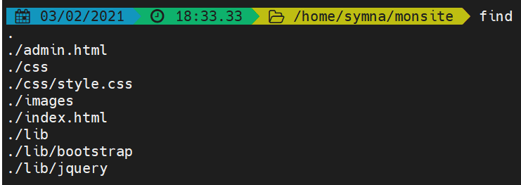

Nacime Boubekeur
03/02/2021  

# Exercices Terminal Gnu Linux #

## Exercice 1 ##

#### 1ère partie ####

1. Le chemin absolu pour référencer track1.mp3 est /home/bob/music/rock/track1.mp3.
2. Le chemin relatif vers track1.mp3 serait /music/rock/track1.mp3.
3. Il n'y a pas de chemin relatif, selon le répertoire courant, on se trouve dans le dossier /images, or track1.mp3 se trouve dans le dossier /music.
4. Même réponse que pour la question précedente, mais à contrario le répertoire courant qui nous est donné est un chemin absolu qui mène à un fichier texte, nous ne pouvons donc y "avancer" davantage.

#### 2nde partie ####

*Répertoire courant : /home/bob/music*

1. Pour se déplacer dans le répertoire rock : cd rock.
2. Pour aller ensuite dans le répertoire tests :  
     cd ..  
     cd ..  
     cd tmp/tests  
3. Puis pour aller dans le répertoire personnel de bob, qui je suppose est /bob  
 cd ..  
 cd ..
4. Pour se déplacer à la racine, nous utiliserons directement :  
    cd /
5. Et pour finir, étant actuellement à la racine, nous devons seulement utiliser la commande :
    cd etc  

## Exercice 2 ##

Voici l'arborescence.

1. Pour afficher le chemin du répertoire, il faut se placer dans le répertoire home et utiliser "find".
2. On se place tout d'abord dans le répertoire mon site avec **cd symna/monsite** puis on utiliser la commande **mkdir .gitignore**.
3. On utilise la commande **ls -l**.  
**ls** permettant ici de lister le contenu d'un répertoire et **-l** de lister avec les informations détaillées.
4. Pour executer la même commande tout en rajoutant les fichiers cachés on utilise cette fois la commande **ls -l -a**.  
**-a** se chargeant ici d'inclure les fichiers cachés.
5. Pour se faire on utilise la commande **cp**, et on entre **cp index.html index2.html** sur le terminal.
6. On entre ici la commande **mkdir archive**.
7. Pour copier tous les fichiers html on utilise __*.html__, ainsi la commande donne :
     __cp__ __*.html /home/symna/monsite/archive__
8. On se place tout d'abord dans le répertoire css avec un **cd css** puis on utilise la commande **mv** qui va nous permettre de renommer. Cela va ainsi donner **mv style.css monsite.css**.
9. On se replace avant tout dans le répertoire monsite avec un **cd ..** puis on utilise une nouvelle fois la commande __*__ qui va nous permettre de supprimer tous les fichiers du répertoires qui commencent par le mot **index**, ce qui est le cas ici, nous n'avons plus qu'à entrer la commande __rm index*__ dans le terminal.
10. En une seule commande il nous faudra nous placer dans le répertoire personnel /symna puis supprimer le répertoire monsite, nous utiliserons **cd .. ; rm -rf monsite**. Ici **;** va nous permettre d'entrer plusieurs commandes à la suite, et **rm -rf** va forcer la suppression d'un répertoire non vide.

## Execice 3 ##

#### 1ère Partie ####

La commande à faire pour cette partie de l'exercice est  
    **mkdir exo3 ; cd exo3 ; touch moi.txt ; echo** *Je suis en BTS SIO* **; echo** *Je suis en BTS SIO* **> moi.txt ; echo** *Et j'aime ça !* **>> moi.txt**

#### 2nde Partie ####

Et pour cette partie j'ai trouvé une commande, qui n'est pas optimale selon moi mais qui remplie les conditions de l'exercice !  
    __cp rois.txt roisFrance.txt ; mv rois.txt /home/symna ; mv roisFrance.txt /home/symna ; cd .. ; rm *.txt ; cd exo3 ; rm rio.txt ; cd .. ; rm -rf exo3 ; reset__

## Exercice 4 ##

- J'utilis la commande **cp -r /bin /home/symna**, le répertoire bin est ainsi crée dans mon répertoire personnel.
- J'affiche le nom de l'utilisateur courant avec la commande **whoami**.
- J'affiche la liste des variables d'environnement avec la commande **env**.

Concernant l'attribution du répertoire /bin à la variable PATH, je n'ai rien eu de concluant sur mon terminal, malgré l'utilisation de certaines commandes telles que **#export PATH="$bin/Scripte:$PATH"** ou **export PATH=$PATH:~/bin**...

Dans l'environnement j'ai pu attribuer **l** à **ls** et à **al** avec **export ls=l**, mais la commande qui marche ici est l -l et non ll comme demandé, ma piste de recherche n'a malheuresement pas pu aller plus loin.

