Nacime  
Boubekeur  
27/02/2021

# Introduction à la virtualisation #

## Etape 1 ##

1. La version installée et utilisée de VirtualBox est la version 6.1.18.

2. Le système d'exploitation hôte est Windows 10 Famille, version 1909.

3. Pour accéder au BIOS manuellement à partir d'un PC allumé, il faut tout d'abord appuyer sur la touche **Windows** où il faudra cliquer sur le rouage qui va nous emmener dans les **paramètres**, ensuite **Mise à jour et sécurité**, on va dans **Récupération** à gauche dans l'onglet déroulant et on descend tout en bas pour cliquer sur **Redémarrer maintenant**.
Nous allons atterir sur un écran bleu où il faudra cliquer sur les éléments suivants :  
**Dépannage -> Option avancées -> Changer les paramètres du microprogramme UEFI -> Redémarrer**    
Nous voici finalement dans le BIOS, pour vérifier le paramètre de configuration qui permet de rendre la virtualisation possible il faut appuyer sur **F7** et cliquer sur **Advanced**, nous voyons ainsi une option **Intel Virtualization Technology** qui est **Enabled**, cela veut dire qu'elle est activé.  

4. Le type de virtualisation mis en oeuvre par l'hyperviseur VirtualBox est le type 2, ce qui veut dire qu'il est possible d'exécuter plusieurs hyperviseurs à la fois contrairement au type 1, mais étant donné que ce type d'hyperviseur s’installe et s’exécute sur un système d’exploitation déjà en place, plus de ressources sont utilisées car en plus du système d'exploitation, on fait également tourner l'hyperviseur simultanément et c'est ce qui nous limite à ce niveau là.

## Etape 2 ##

1. La version installée est Debian GNU/Linux 10.8.0
2. L'installation requiert plusieurs étapes importantes mais avant cela il nous faut configurer une machine.

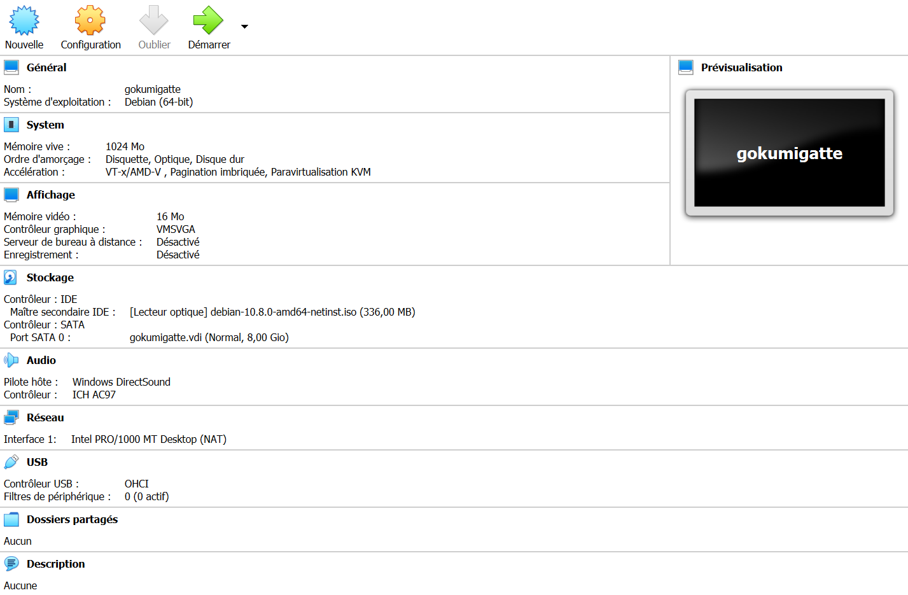

Voici une configuration, je dis une car il existe beaucoup de configuration différentes, celle-ci peut très bien servir d'exemple car elle est tout à fait fonctionnelle.

Maintenant que la machine est configuré, passons à l'installation, voici les étapes requis, il n'est pas nécessaire de tout détailler mais je vais lister celles qui sont selon moi les plus importantes.

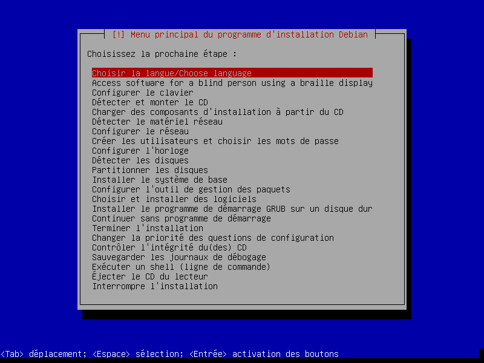

Premièrement, indiquer le nom du système, dans notre cas qui installons notre propre réseau cela a peu d'importance mais il est bien de souligner que dans un environnement professionnel, il est nécessaire de connaitre ce nom pour identifier le système sur le réseau.

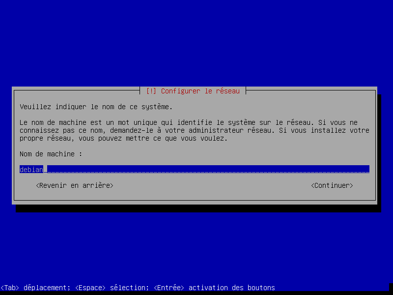

Ensuite vient le nom domaine, encore une fois nous paramétrons nous même notre réseau cela a donc pas d'importance d'en mettre un.

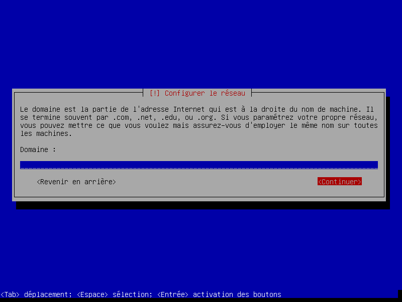

S'en suit l'étape du **superutilisateur**, il ne faut pas rentrer d'identifiant ni de mot de passe, cela créera un administrateur qui, dans notre cas, posera plus de problèmes qu'autre chose.

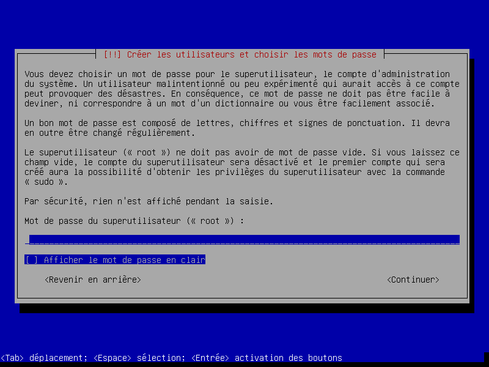

Après cette étape, il faudra simplement créer son identifiant et mot de passe personnel.

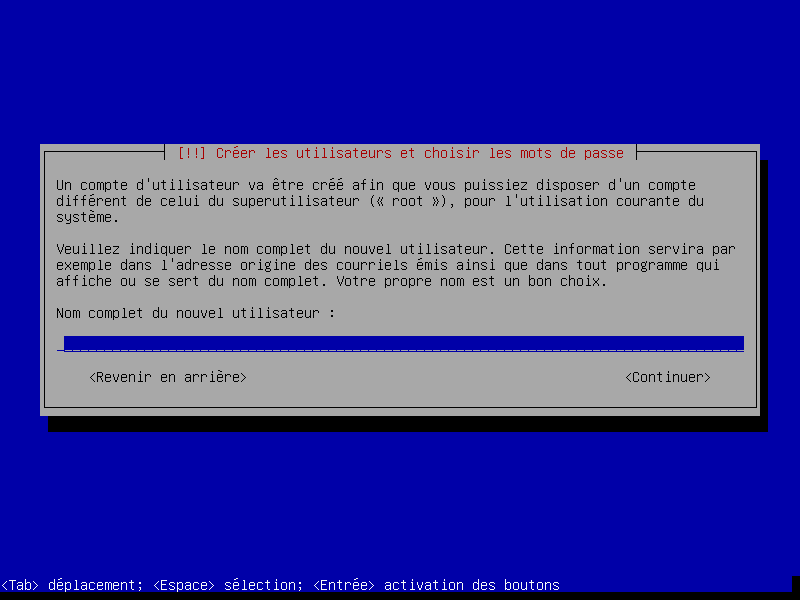

Nous devons ensuite partitionner les disques, pour ma part j'ai utilisé un disque entier.

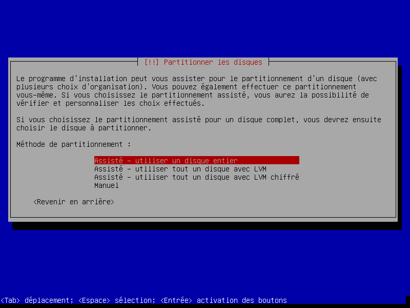

Et concernant mon schéma de partition, j'ai choisi l'option recommandé pour les débutants.

Et pour finir, on termine le partionnement et on applique les changements sur les disques.

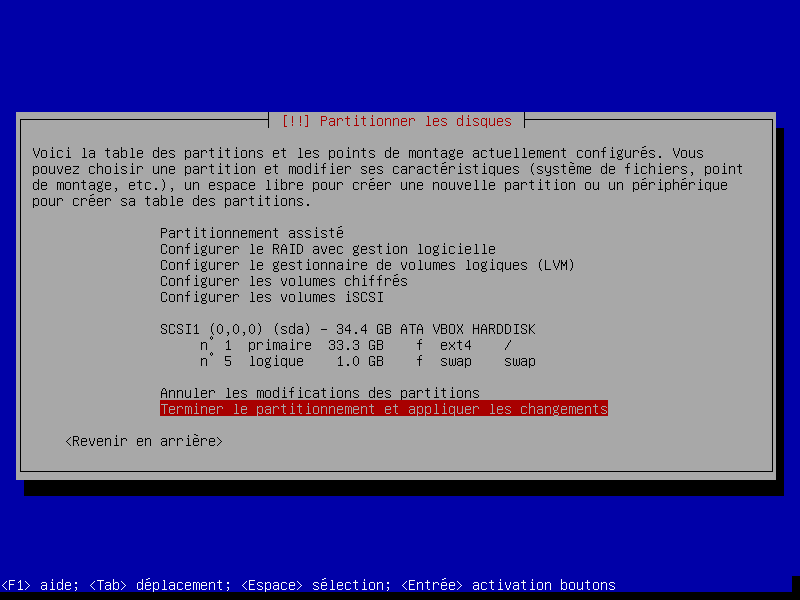

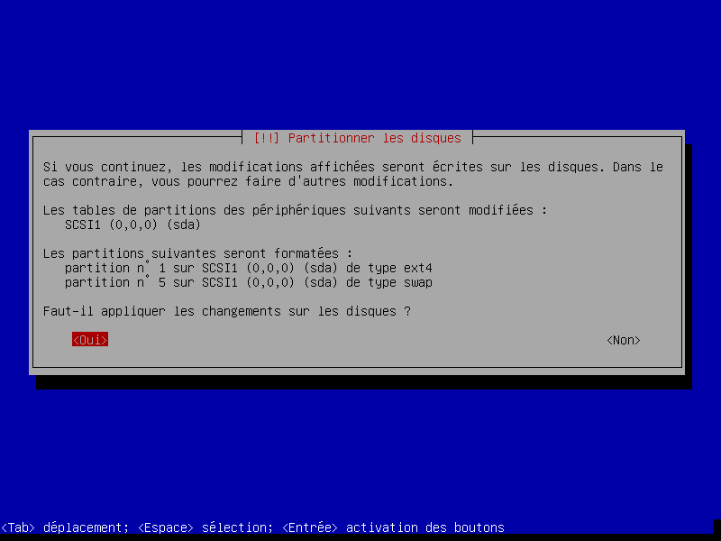

Ensuite la machine va nous demander si on veut analyser un autre CD ou DVD, j'ai mis non pour ma part.

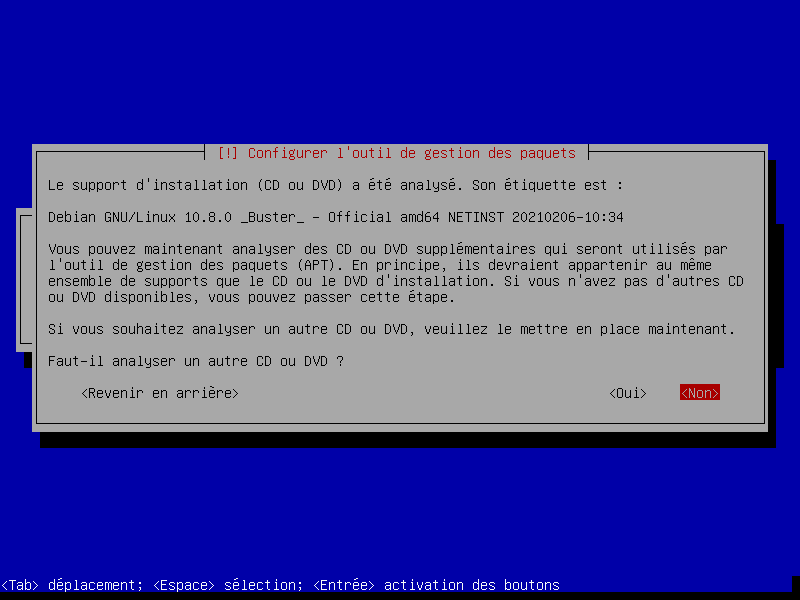

Par la suite nous vient le choix du miroir de l'archive debian, je vais prendre deb.debian.org car selon la machine ce choix est pertinent.

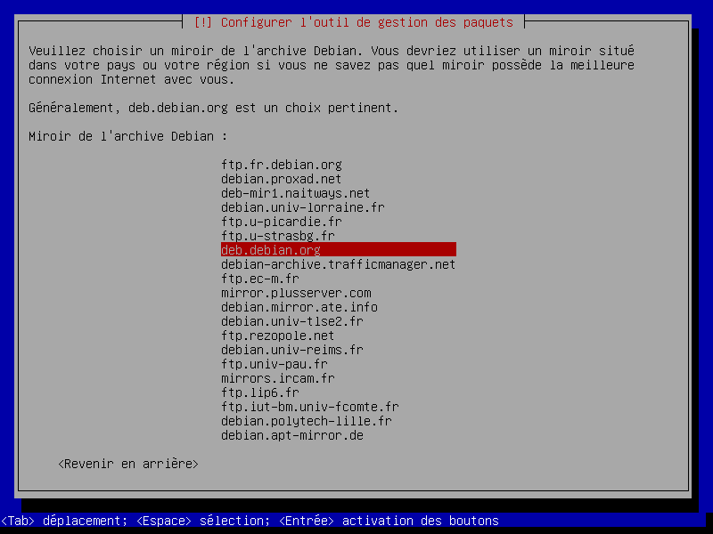

Puis vient le choix du mandataire HTTP, c'est un serveur proxy qui peut servir pour nous assurer plusieurs fonctions telle que l'anonymat mais dans notre cas nous n'en avons pas réellement besoin.

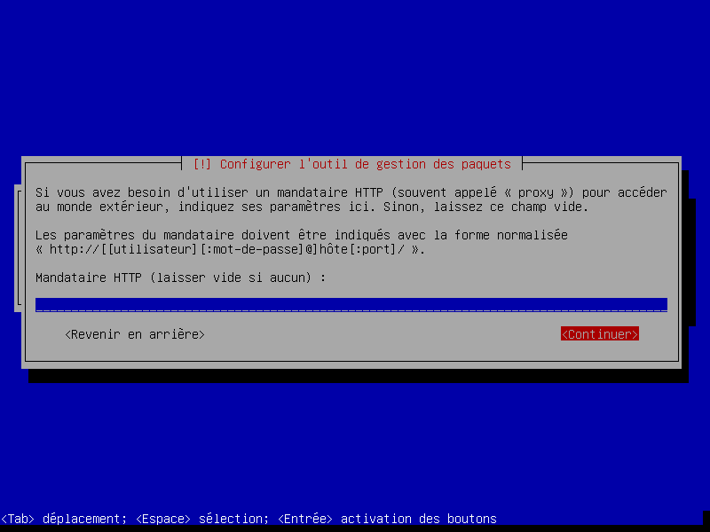

Et pour finir, nous pouvons commencer l'installation, cependant la machine va nous proposer certains logiciels supplémentaires à rajouter à l'installation, dans notre cas nous choisirons le GNOME et le serveur SSH.

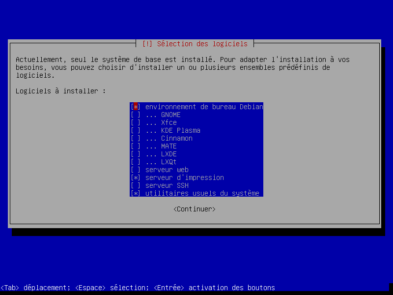

Cependant, il nous manque le programme de démarrage GRUB, que la machine va bien entendu nous proposer d'installer, pour ma part je l'installerai sur mon disque dur.

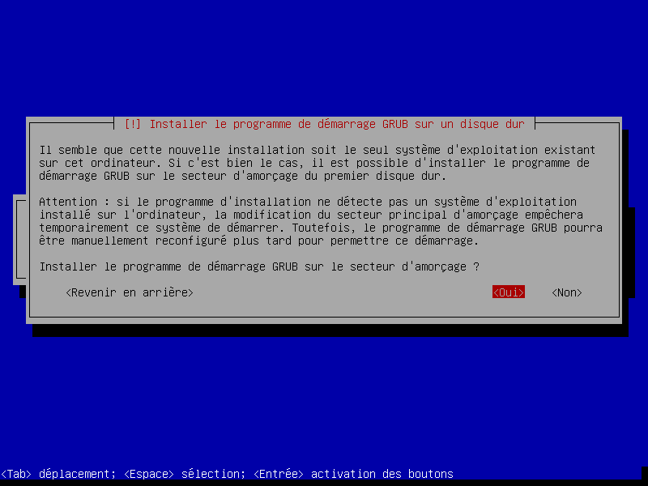

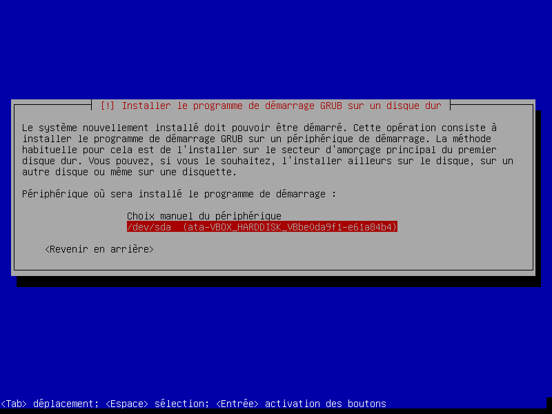

Et voilà, un beau message nous disant que votre installation est terminée !

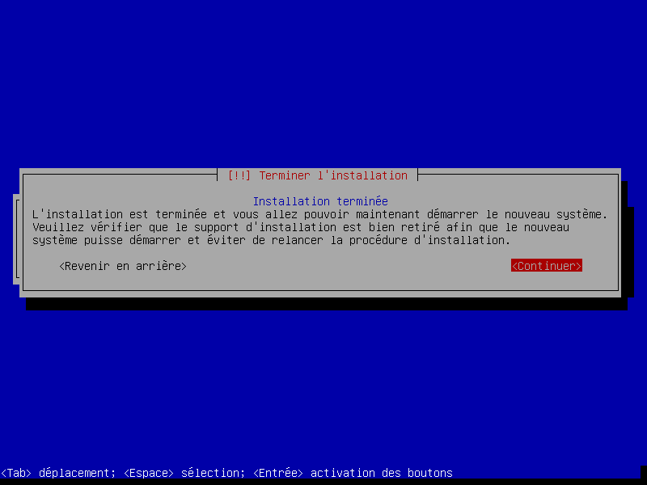

Il ne manquera plus qu'à entrer le mot de passe de sa session

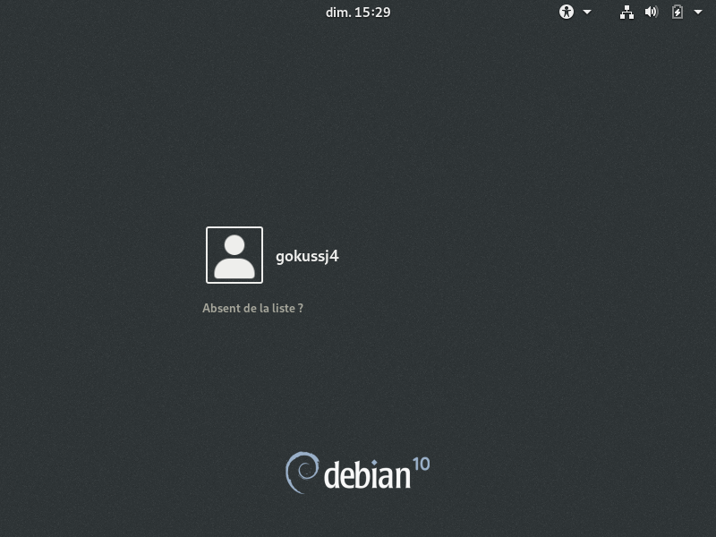

3. Login : gokussj4 - Mot de passe : Chocolat78-

4. La liste exhaustive des logiciels installés :
- Agenda
- Ajustements de GNOME
- Cartes de GNOME
- Cheese
- Cinq ou plus
- Contacts
- Disques de GNOME
- Documents
- Démineur de GNOME
- Enregistreur de son
- Evolution
- File Roller
- Firefox ESR 
- Gestionnaire colorimétrique de GNOME
- GNOME Logs 
- GNOME Mahjongg
- GNOME Nibbles
- GNOME Tetravex
- Hitori de GNOME
- Horloges de GNOME
- lagno
- Jeu d'échecs de GNOME
- Klotski de GNOME
- LibreOffice Calc
- LibreOffice Draw
- LibreOffice Impress
- LibreOffice Math 
- LibreOffice Writer
- Musique de GNOME
- Météo
- Nautilus
- Outil de numérisation Simple Scan
- Quadrapassel
- Quatre-à-la-suite
- Rhythmbox
- Robots de GNOME
- Seahorse
- Software & Updates
- Solitaire Aisleriot
- Sudoku de GNOME
- Swell Foop
- Tali
- Taquin de GNOME
- To Do 
- Toutéteint
- Transmission
- Vim
- Visionneur de bureaux distants 

Et ces logiciels qui sont dans la catégorie **Applications système** :

- Aide de GNOME
- Analyseur d'utilisation des disques
- Calculatrice de GNOME
- Capture d'écran de GNOME
- Centre de contrôle de GNOME
- Evince
- Eye of GNOME
- gedit
- Logiciels de GNOME
- Moniteur système de GNOME
- Polices de GNOME
- Terminal
- Vidéos

## Etape 3 ##

1. Lorsque je suis à l'ESIEE IT le, réseau physique que j'utilise la WIFI.

2. Le mode d'accès réseau de ma machine est NAT, c'est de cette façon qu'elle arrive à accéder à internet

3. La procédure utilisée pour vérifier l'accès à internet par la machine virtuelle a été d'ouvrir mon terminal pour entrer la commande suivante `ping 10.0.2.15 -c 3` **10.0.2.15** étant mon ip, ip que j'ai trouvé en entrant la commande `hostname -I`, **-c** veut dire **count**, ainsi **-c 3** va me permettre de dire à la machine de ne répeter l'action que 3 fois, car sur Linux la commande seule va nous afficher une répétition infini, sauf si on l'arrête manuellement.

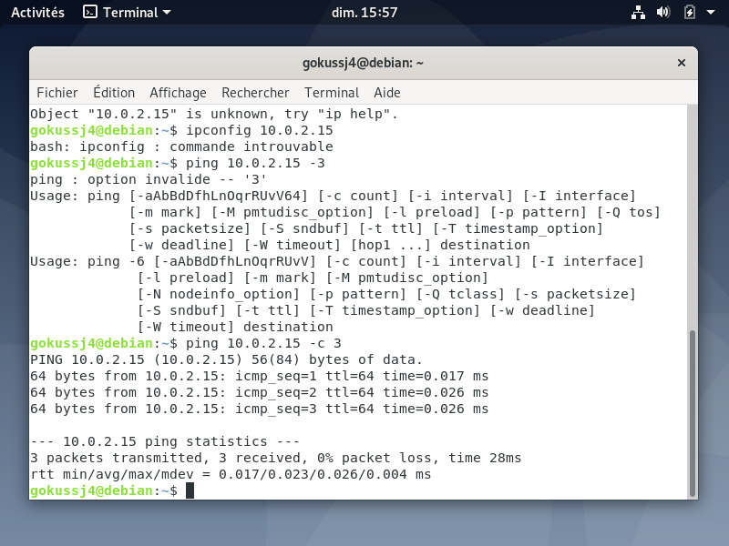

