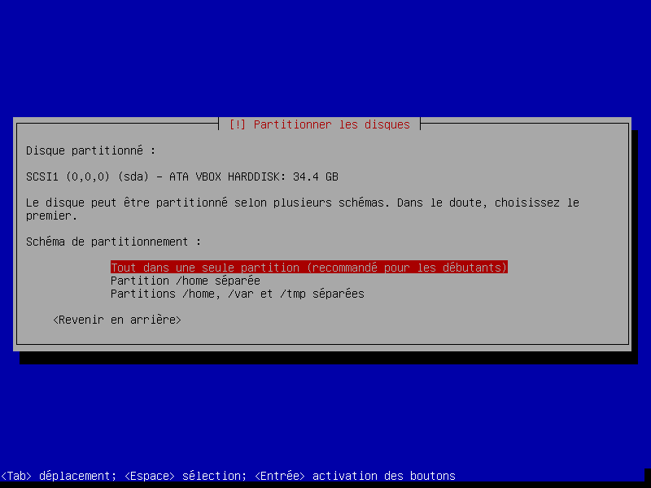

Nacime  
Boubekeur  
27/02/2021

# Introduction à la virtualisation #

## Etape 1 ##

1. La version installée et utilisée de VirtualBox est la version 6.1.18.

2. Le système d'exploitation hôte est Windows 10 Famille, version 1909.

3. Pour accéder au BIOS manuellement à partir d'un PC allumé, il faut tout d'abord appuyer sur la touche **Windows** où il faudra cliquer sur le rouage qui va nous emmener dans les **paramètres**, ensuite **Mise à jour et sécurité**, on va dans **Récupération** à gauche dans l'onglet déroulant et on descend tout en bas pour cliquer sur **Redémarrer maintenant**.
Nous allons atterir sur un écran bleu où il faudra cliquer sur les éléments suivants :  
**Dépannage -> Option avancées -> Changer les paramètres du microprogramme UEFI -> Redémarrer**    
Nous voici finalement dans le BIOS, pour vérifier le paramètre de configuration qui permet de rendre la virtualisation possible il faut appuyer sur **F7** et cliquer sur **Advanced**, nous voyons ainsi une option **Intel Virtualization Technology** qui est **Enabled**, cela veut dire qu'elle est activé.  

4. Le type de virtualisation mis en oeuvre par l'hyperviseur VirtualBox est le type 2, ce qui veut dire qu'il est possible d'exécuter plusieurs hyperviseurs à la fois contrairement au type 1, mais étant donné que ce type d'hyperviseur s’installe et s’exécute sur un système d’exploitation déjà en place, plus de ressources sont utilisées car en plus du système d'exploitation, on fait également tourner l'hyperviseur simultanément et c'est ce qui nous limite à ce niveau là.

## Etape 2 ##

1. La version installée est Debian GNU/Linux 10.8.0
2. L'installation requiert plusieurs étapes importantes mais avant cela il nous faut configurer une machine.

Voici une configuration, je dis une car il existe beaucoup de configuration différentes, celle-ci peut très bien servir d'exemple car elle est tout à fait fonctionnelle.

Maintenant que la machine est configuré, passons à l'installation, voici les étapes requis, il n'est pas nécessaire de tout détailler mais je vais lister celles qui sont selon moi les plus importantes.

Premièrement, indiquer le nom du système, dans notre cas qui installons notre propre réseau cela a peu d'importance mais il est bien de souligner que dans un environnement professionnel, il est nécessaire de connaitre ce nom pour identifier le système sur le réseau.

Ensuite vient le nom domaine, encore une fois nous paramétrons nous même notre réseau cela a donc pas d'importance d'en mettre un.

S'en suit l'étape du **superutilisateur**, il ne faut pas rentrer d'identifiant ni de mot de passe, cela créera un administrateur qui, dans notre cas, posera plus de problèmes qu'autre chose.

Après cette étape, il faudra simplement créer son identifiant et mot de passe personnel.

Nous devons ensuite partitionner les disques, pour ma part j'ai utilisé un disque entier.

Et concernant mon schéma de partition, j'ai choisi l'option recommandé pour les débutants.

Et pour finir, on termine le partionnement et on applique les changements sur les disques.

Ensuite la machine va nous demander si on veut analyser un autre CD ou DVD, j'ai mis non pour ma part.

Ensuite vient le choix du miroir de l'archive debian, je vais prendre deb.debian.org car selon la machine ce choix est pertinent.

Puis vient le choix du mandataire HTTP, c'est un serveur proxy qui peut servir pour nous assurer l'anonymat mais dans notre cas nous n'en avons pas besoin

