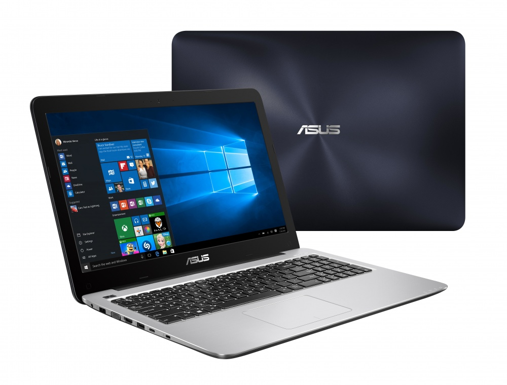

Nacime Boubekeur  
13/10/2020
# **Découverte d’une première Solution technique d’accès (STA)** #

### La marque : ASUS  

### Les composants essentiels et leurs caractéristiques :
- **RAM** : 6,00 Go
- **Processeur** : Intel(R) Core(TM) i5-7200U CPU @ 2.50GHz 2.71 GHZ
### Les connecteurs disponibles :

### Le système d’exploitation et ses caractéristiques :

### Logiciels installés (version, type de licence) :

### Les possibilités d’évolution matériel ou logiciel :
